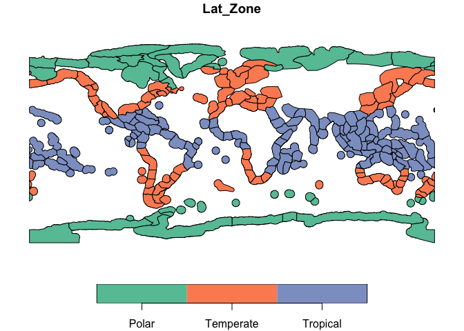

MEOW
================

Serving The Nature Conservancy’s (TNC) Marine Ecoregions Of the World
[MEOW](https://hub.arcgis.com/datasets/903c3ae05b264c00a3b5e58a4561b7e6/about)
polygons from within R.

### Requirements

-   [R v4.1+](https://www.r-project.org/)
-   [sf](https://CRAN.R-project.org/package=sf)

### Installation

    remotes::install_github("BigelowLab/meow")

### Usage

``` r
library(sf)
```

    ## Linking to GEOS 3.9.1, GDAL 3.4.0, PROJ 8.1.1; sf_use_s2() is TRUE

``` r
library(meow)

x <- meow::read_meow()

plot(x['Lat_Zone'])
```

<!-- -->
